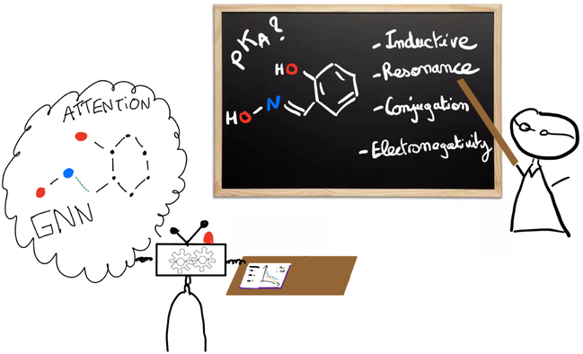

# pKa-predictor

Leveraging our Teaching Experience to Improve Machine Learning: Application to pKa PredictionJérôme Genzling, Ziling Luo, Benjamin Weiser, Nicolas Moitessier
nicolas.moitessier@mcgill.ca
2023-12-07 – revised 2025-05-16

# 🔍 What is this?

A Graph Neural Network (GNN) model for:

- Predicting pKa values of ionizable centers
- Identifying protonation sites
- Estimating dominant protonation states at a given pH
- Supporting iterative protonation/deprotonation of polyprotic molecules

# 🧪 Core Functionalities

- Input: CSV with SMILES and (optionally) ionizable atom indices
- Output: pKa value(s), and major protonated species at given pH
- Iterative inference for molecules with multiple ionizable centers
- Easily extendable to new datasets or re-trainable on custom data

# 📦 Required Libraries

Install with pip:

pip install torch torch_geometric pandas numpy rdkit seaborn hyperopt

You can also recreate our virtual environment using environment.yml

# 📁 Repository Structure

Datasets/ : All cleaned, split, and raw datasets

Baseline_Models/Descriptors/ : Code to generate traditional descriptors

Baseline_Models/RF, /XGB : Traditional model training scripts (Random Forest/XGB)

GNN/ : All code related to GNN/GAT models

MolGpKa_retrained/ : Code and data for retraining MolGpKa

# 🚀 Getting Started with the GNN

## 1. See available options

python main.py --mode usage

All possible arguments and their default values will be printed.

## 2. Predict pKa on a sample set
Your CSV will need to have at least two columns: 'Name' and 'Smiles'

On Windows:

python main.py --mode infer --input your_input.csv > infer_your_input.out

On Linux: 

python main.py --mode infer --data_path ..\Datasets\ --input your_input.csv --infer_pickled ..\Datasets\pickled_data\infer_pickled.pkl --model_dir ..\Model\ > infer_your_input.out

## 3. Predict from a CSV in Python

You can also use the predict() function directly:

from predict import predict

predicted_pkas, protonated_smiles = predict("your_dataset.csv", pH=7.4)

## 4. Verbose Levels

Use the --verbose flag to control output detail:

--verbose 0: No details printed in the output (silent mode)

--verbose 1: Summary of predictions + Some cleaning details

--verbose 2: Detailed view of every deprotonation step

# 📖 Citation

If you use this code or model, please cite:

Genzling J, Luo Z, Weiser B, Moitessier N. Leveraging our Teacher’s Experience to Improve Machine Learning: Application to pKa Prediction. ChemRxiv. 2024; doi:10.26434/chemrxiv-2024-bpd53-v2 
This content is a preprint and has not been peer-reviewed.

# 🧠 Tips

Use Cheminfo SMILES viewer to visualize and debug SMILES (https://www.cheminfo.org/Chemistry/Cheminformatics/Smiles/index.html)

If protonation states are off, check atom indexing or consider using neutral forms.

You can retrain on your own dataset by modifying train_pKa_predictor.py.

# 🛠 Support

Feel free to reach out via email or GitHub issues if you need help using or adapting the model.

